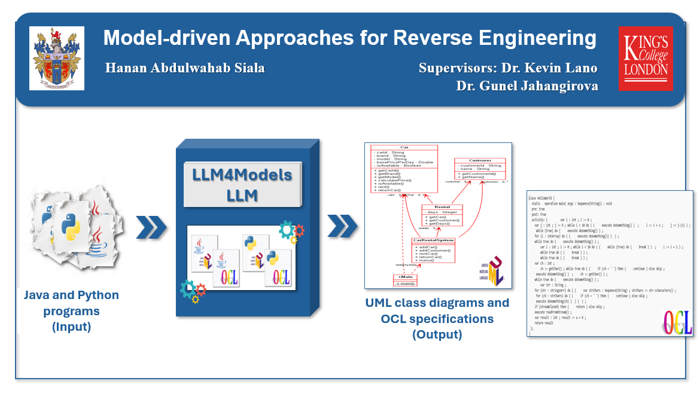

# Thesis Artifacts

This repository contains all artifacts used in my thesis, which are classified into four main groups:

## 1. [LLM4Models](./LLM4Models/)  
Contains models to abstract UML and OCL representations from Java and Python programs.
## 2. [evaluation](./evaluation/)  
Provides case studies used to evaluate the LLM4Models approach.
## 3. [src](./src/)
Contains the most important scripts used in the thesis work.
## 4. [training datasets](./training-datasets/)
Contains training datasets.

---

### Repository Structure

```
.
├── LLM4Models                  # The generated LLM4Models LLM
│   ├── Java-OCL
│   ├── Java-UML                
│   ├── Python-OCL              
│   ├── Python-UML
├── evaluation
│   ├── case-studies
│   │   ├── Java-OCL
│   │   ├── Java-UML                
│   │   ├── Python-OCL              
│   │   ├── Python-UML
│   ├── experiments
│   │   ├── LLM4Models
│   │   │   ├── Java-OCL
│   │   │   ├── Java-UML                
│   │   │   ├── Python-OCL              
│   │   │   ├── Python-UML
│   │   ├── LLMs
│   │   │   ├── Java-OCL
│   │   │   ├── Java-UML                
│   │   │   ├── Python-OCL              
│   │   │   ├── Python-UML
├── images
├── src                     
│   ├── dataset                 # Scripts to construct the training datasets
│   ├── fine-tuning             # Scripts to fine-tune Mistral-7B LLM   
│   ├── inference               # Scripts for inferring UML class diagrams and OCL specifications
│   ├── parsers                 # Java2JSON and Python2JSON parsers/abstractors
├── training-datasets
│   ├── Java-OCL
│   ├── Java-UML                
│   ├── Python-OCL              
│   ├── Python-UML              
└── README.md
```

---
### Inferring Process
<!-- │   ├── Statistics              # Scripts to compare the results of LLM4Models LLM with: 1) the results of Java2JSON and Python2JSON (UML) -->
<!-- │   │                                                                                    2) the results of the AgileUML toolset (OCL) -->

---

#### **1. Pre-processing Stage**
Before starting the inferring process for abstracting UML and OCL representations, a pre-processing stage should be applied to the Java/Python program by executing the **`Preprocessing`** Python script. Configure the following options:

**Options:**
- **Language:** `Java` or `Python`.  
- **InputDirectory:** Path to source program(s) before pre-processing.  
- **OutputDirectory:** Path where the pre-processed program will be saved.  

**Output:**
- Java → **`Test1.java`**. 
- Python → **`Test1.py`**.

---

#### **2. Inferring Stage**
1. Place your program in:
   - **`Test1.java`** for Java code.  
   - **`Test1.py`** for Python code.  
2. The output will be saved in **`LLM4Models.txt`**.  
3. Set the **`What_I_Want`** variable:
   - `1` → Abstract UML class diagrams from Java code.  
   - `2` → Abstract UML class diagrams from Python code.  
   - `3` → Abstract OCL specifications from Java code.  
   - `4` → Abstract OCL specifications from Python code.  
4. Set **`Full_Model = True`** to use the full model, or **`Full_Model = False`** to use a LoRA adapter.  
5. Choose **`version = 1`** or **`version = 2`** or **`version = 3`** or **`version = 4`** for UML abstraction.
5. Choose **`version = 1`** or **`version = 2`** for OCL abstraction.

---

#### **3. Post-Processing Stage**

**a) UML Class Diagrams**
- Apply post-processing to the output of **`LLM4Models`** LLM using:
  1. **`PostprocessingUML`** Python script — splits LLM output into two files in JSON format (`Test1.UML` and `Test1.REL`).  
  2. **`DrawingClassDiagram`** Python script — generates a UML class diagram from the two JSON files using the **Graphviz** tool and saves it as `Test1.png`. Please install the Graphviz tool before running the script.

**Method display options:**
- Methods with parameters’ names and types.  
- Methods with parameter’ types only.  
- Methods only *(default)*.

**b) OCL Specifications**
- Apply post-processing using **`PostprocessingOCL`** Python script to convert LLM output into OCL specification files.

---

### Languages Used
- Python (primary).

---

### Requirements

To run the provided inference programs locally, you need:

- Python 3.10+
- An NVIDIA GPU with CUDA support
- A GPU compatible with `bfloat16`
- PyTorch 2.2.2
- The Python dependencies listed in [`requirements.txt`](requirements.txt)

---

### Installation

Install the required Python packages with:

```bash
pip install -r requirements.txt
```

The programs use Hugging Face Transformers and PEFT to load the Mistral or DeepSeek-Coder models and their fine-tuned adapters.

> **Note:** Running the models locally requires sufficient GPU memory. The required GPU memory depends on whether you use the full model or the LoRA adapter version.
---

### Available Programs

The repository provides inference programs for:

- **Extracting UML Class diagrams from Java and Python programs**
- **Extracting UML OCL specifications from Java and Python programs**  
- **Mistral-based** fine-tuned models
- **LoRA adapter** and **full-model** inference

For the LoRA versions, the base model is downloaded automatically from Hugging Face, and the corresponding fine-tuned adapter is loaded.

For the full-model versions, the fine-tuned model is loaded directly from Hugging Face.

### Gradio Interface

For users who prefer a graphical interface, a Gradio-based interface is also available in the related GitHub repository, [LLM4Models](https://github.com/Hanan-Abdulwahab-Siala/LLM4Models).

---

### Citation

If you use this repository or reference the thesis, please cite:

**Model-driven Approaches for Reverse Engineering, PhD Thesis, Hanan Abdulwahab Siala, supervised by Kevin Lano and Gunel Jahangirova, 2025, King's College London**

---

### BibTeX
```bibtex
@phdthesis{siala2025reverse,
  title        = {Model-driven Approaches for Reverse Engineering},
  author       = {Hanan Abdulwahab Siala},
  school       = {King's College London},
  year         = {2025},
  note         = {PhD Thesis. Supervised by Kevin Lano and Gunel Jahangirova}
}
```

---


